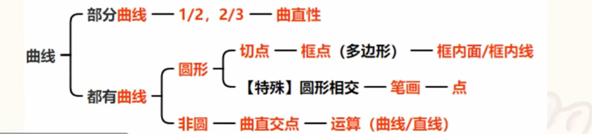

```markmap
---
markmap:
  colorFreezeLevel: 3
---

# 面
## 基础考点
- 特征
  - 分割、封闭、==生活化==
- 考点
  - 面的数量、==面的运算（九宫格）==

## 细化考点
- 所有面
  - 特征：每个面形状一样
    - 形状
  - 特征：都有三角形
    - 三角形
- 大小面
  - 特征
    - 明显大面/小面
      - 形状、属性、面积
- 相同面
  - 特征
    - 有一样的面 

## 黑白块
- 黑块被分割、背景有网格
  - 面积
    - 占比
      - 1/2、1/3、1/4等
    - 比大小
      - 黑色面积与白色面积比较
        
        
# 线

## 基础考点
- 特征
  - 单一线条、都有曲线、多边形边框
- 考点
  - 线的数量（线的运算）
    - 曲线/直线
    - 横线/竖线
    - 外框/外框

## 细化考点
- 平行线
  - 特征
    - 斜线、相似三角形
  - 考点
    - 组数、条数
      
# 点

## 基础考点
- 特征
  - 面特征、多端点（笔画没有规律才考虑点）
- 考点
  - 点的数量

## 细化考点

- 特征
 - 都有曲线
  - 圆形
    - 切点
      - 框点（借助多边形）
  - 非圆
    - 曲直交点 
```