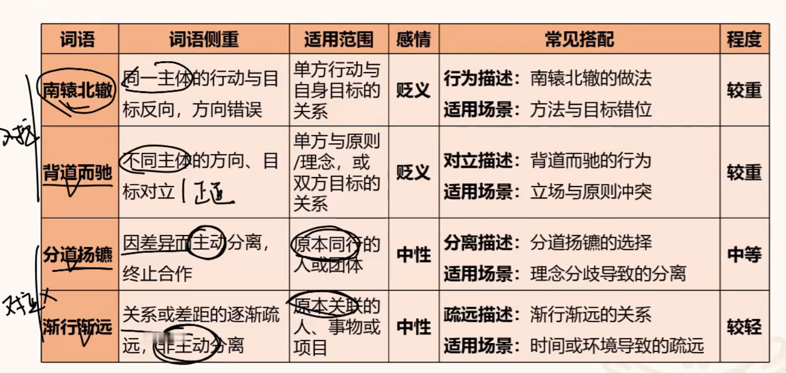

| 组别   | 成语       | 内涵与差别                                                                                                                      |
| ---- | -------- | -------------------------------------------------------------------------------------------------------------------------- |
| 1    | 深入浅出     | 讲话或文章内容深刻，但语言浅显易懂                                                                                                          |
|      |          |                                                                                                                            |
| 2    | 守株待兔     | 不主动努力，而存万一侥幸心理                                                                                                             |
|      |          |                                                                                                                            |
| 3    | 珠联璧合     | 比喻杰出的人才或美好的事物结合在一起                                                                                                         |
|      | 融会贯通     | 各方面知识或道理融合贯穿，从而得到系统、透彻理解                                                                                                   |
|      | 休戚与共     | 祸福都共同承担，一般只能指有祸福可言的人、集团、国家等相互间的关系，不能指无祸福可言的一般事物。‌                                                                          |
|      | 休戚相关     | 祸福利害相关联                                                                                                                    |
|      | 唇齿相依     | 相互依存(如:命运共同体)                                                                                                              |
|      | 水乳交融  | 融合、关系融洽                                                                                                                    |
|      | 浑然一体     | 完整不可分割，强调整体性                                                                                                               |
|      | 息息相关     | 指彼此关系非常密切                                                                                                                  |
|      |          |                                                                                                                            |
| 4    | 心无旁骛     | 形容做事注意力集中，专心致志                                                                                                             |
|      | 目不转睛     | 眼珠一动不动盯着看，形容注意力很集中                                                                                                         |
|      |          |                                                                                                                            |
| 5    | 脚踏实地     | 把脚稳稳地踩在地上。形容做事认真踏实                                                                                                         |
|      | 稳扎稳打     | 打仗时步步设营，采取稳妥的办法打击敌人。比喻做事稳妥而有把握                                                                                             |
|      |          |                                                                                                                            |
| 6    | 大有可为     | 事情很值得做，很有发展前途                                                                                                              |
|      | 大有裨益     | 形容益处很大                                                                                                                     |
|      |          |                                                                                                                            |
| 7    | 前功尽弃     | 以前的功劳完全废弃，或以前的努力全部白费                                                                                                       |
|      | 功败锤成     | 事情接近成功的时候却遭到了失败                                                                                                            |
|      |          |                                                                                                                            |
| 8    | 不言而喻     | 不用说就可以明白                                                                                                                   |
|      | 母庸置疑     | 事实明显或理由充分，不必怀疑                                                                                                             |
|      |          |                                                                                                                            |
| 9    | 一劳永逸     | 付出一次劳动的代价，把事情办好，以后就不再费劲了                                                                                                   |
|      | 一挥而就     | 形容写字、写文章、绘画很快就完成了                                                                                                          |
|      | 敷衍了事     | 指做事不负责，表面上应付一下便完事                                                                                                          |
|      | 急功近利     | 指急于求成，贪图眼前的成效和利益                                                                                                           |
|      |          |                                                                                                                            |
| 10   | 大而无当     | 言辞夸大而不切实际                                                                                                                  |
|      | 一纸空文     | 只是写在纸上没有兑现或不能兑现的东西，均强调不实行、不实现，而非内容本身无道理、无价值                                                                                |
|      | 徒托空言     | 只讲空话，而不实行                                                                                                                  |
|      |          |                                                                                                                            |
| 11   | 钟鸣鼎食     | 击钟列鼎而食，形容贵族的豪华排场                                                                                                           |
|      | 荆钗布裙     | 以荆枝作钗，以粗布作裙，形容妇女服饰朴素                                                                                                       |
|      |          |                                                                                                                            |
| 12   | 漫不经心     | 随随便便，不放心上，侧重表示做事不认真                                                                                                        |
|      | 随心所欲     | 随着自己的意思，想要干什么就干什么                                                                                                          |
|      |          |                                                                                                                            |
| 13   | 青黄不接     | 后继人力、财力暂断现象                                                                                                                |
|      | 半青半黄     | 事物尚未达到成熟                                                                                                                   |
|      |          |                                                                                                                            |
| 14   | 物尽其用     | 充分利用资源，一点不浪费                                                                                                               |
|      | 精打细算     | 在使用人力物力上精心细致地计算安排，侧重主观上细致计算，而非充分利用资产                                                                                       |
|      | 量入为出     | 根据收入的多少来决定开支的限度与要求，侧重在自己的能力范围之内规划支出，而非充分利用资产                                                                               |
|      | 开源节流     | 增加收入，节省开支                                                                                                                  |
|      |          |                                                                                                                            |
| 15   | 齿牙余论     | 微末的赞扬言辞，比喻不费力的奖励的话                                                                                                         |
|      | 不刊之论     | 正确的、不可修改的言论                                                                                                                |
|      | 昙花一现     | 美好的事物或景象出现了一下，很快就消失                                                                                                        |
|      | 明日黄花     | 比喻迟暮不遇之意，也比喻过时或无意义的事物                                                                                                      |
|      |          |                                                                                                                            |
| 16   | 门可罗雀     | 门庭冷落、宾客稀少之况                                                                                                                |
|      |          |                                                                                                                            |
| 17   | 高屋建瓴     | 居高临下，形势不可阻挡，含褒义                                                                                                            |
|      | 登峰造极     | 比喻造诣达到极高的境地，也比喻某种事物发展到极点，侧重强调水平高                                                                                           |
|      | 高高在上     | 形容领导者脱离实际，脱离群众，含贬义                                                                                                         |
|      | 曲高和寡     | 比喻言论或艺术作品不通俗，能理解或欣赏的人很少，为中性词                                                                                               |
|      |          |                                                                                                                            |
| 18   | 手高手低     | 形容技艺或水平不一样，有的高有的低                                                                                                          |
|      | 厚此薄彼     | 优厚某一方而冷落另一方。指对人或事不一视同仁，而有所偏颇。                                                                                              |
|      |          |                                                                                                                            |
| 19   | 此消彼长     | 指这个下降，那个上升                                                                                                                 |
|      | 形影相吊     | 原义是孤身一人，只有和自己的身影相互慰问，形容无依无靠，非常孤单                                                                                           |
|      | 如影随形     |                                                                                                                            |
|      |          |                                                                                                                            |
| 20   | 动辄得咎     | 动不动就受到责备或处分，置于此处表示只要发现一点不良风气就会处分                                                                                           |
|      | 小题大做     | 指把小事当作大事来办                                                                                                                 |
|      |          |                                                                                                                            |
| 21 薪 | 抱薪救火     | 方式不对，灾祸反而扩大                                                                                                                |
|      | 杯水车薪     | 方式不对，无法解决问题/力量小                                                                                                            |
|      | 曲突徙薪     | 提前做好准备，预防                                                                                                                  |
|      |          |                                                                                                                            |
| 22   | 居安思危     | 在安定的环境中，思考可能出现的危险。思想。                                                                                                      |
|      | 未雨绸缪     | 没下雨前就修补好门窗，比喻提前准备以应对可能发生的问题。不分好坏。行动。                                                                                       |
|      | 防微杜渐     | 在错误或危险刚露出苗头时，就及时制止，不让它发展扩大。已发生苗头。                                                                                          |
|      | 防患未然     | 在祸患发生之前就加以预防，避免其出现。防患，坏的。                                                                                                  |
|      |          |                                                                                                                            |
| 23   | 奇货可居     | 意为把稀有的货物储存起来，等待高价卖出去，后比喻拿某种专长或独占的东西作为资本，等待时机，以捞取名利地位。                                                                      |
|      | 待价而沽     | 等待合适时机再行动，不盲目出手。                                                                                                           |
|      |          |                                                                                                                            |
| 24   | 不寒而栗     | 不寒冷而发抖，形容非常恐惧                                                                                                              |
|      | 寝食难安     | 心事重重，焦虑不安                                                                                                                  |
|      | 手足无措     | 形容非常慌张，不知如何是好                                                                                                              |
|      |          |                                                                                                                            |
| 25   | 相辅相成     | 两者相互配合的必要性，缺一不可（配合补充共促成，必要性）                                                                                               |
|      | 相得益彰     | 配合后效果增强，各自优势更显著（配合增效显优势）                                                                                                   |
|      | 珠联璧合     | 比喻杰出的人才或美好的事物结合在一起（强强联合更完美）                                                                                                |
|      | 互为表里     | 内外对应、本质与形式依存，逻辑上表里关联（内外依存互对应，必要性）                                                                                          |
|      |          |                                                                                                                            |
| 26   | 因噎废食     | 比喻要做的事，由于除了小毛病或者怕出问题就索性不去干                                                                                                 |
|      | 畏疾忌医     | 比喻怕人批评而掩饰自己的缺点和错误                                                                                                          |
|      | 投鼠忌器     | 比喻有顾虑，想干而不敢干                                                                                                               |
|      |          |                                                                                                                            |
| 27   | 相形见绌     | 同类事物相比较，显出不足                                                                                                               |
|      | 自愧弗如     | 自己惭愧，觉得不如别人（主动承认差距）                                                                                                        |
|      |          |                                                                                                                            |
| 28   | 一挥而就     | 文章作画一下子完成，才思敏捷                                                                                                             |
|      | 一蹴而就     | 轻易成功，不用经过长时间努力                                                                                                             |
|      |          |                                                                                                                            |
| 29   | 大显身手     | 充分展示本领和才能，在合适场合发挥优势（场合刚好能充分发挥能力）                                                                                           |
|      | 牛刀小试     | 大炮打蚊子，大本领在小事上略施才能                                                                                                          |
|      | 脱颖而出     | 多在对比语境重，从众多人中凸显出来                                                                                                          |
|      |          |                                                                                                                            |
| 30   | 拾人牙慧     | 抄袭、套用他人观点                                                                                                                  |
|      | 随波逐流     | 跟着潮流走，缺乏主见（没有立场，盲目跟随他人）                                                                                                    |
|      | 人云亦云     | 缺乏独立思考，盲目附和                                                                                                                |
|      | 避重就轻     | 回避关键问题，挑容易的做                                                                                                               |
|      |          |                                                                                                                            |
| 31   | 同日而语     | 将两人或两件事放在同一时间进行讨论                                                                                                          |
|      |          |                                                                                                                            |
| 32   | 海纳百川     | 大海能容纳千百条江河之水。比喻心胸宽广，能包容接纳各种事物。                                                                                             |
|      | 兼容并蓄     | 把不同的人或事物都收容包罗进来                                                                                                            |
|      |          |                                                                                                                            |
| 33   | 异彩纷呈     | 形容事物色彩、风格多样，侧重突出内容或形式的多样性与精彩度。                                                                                             |
|      | 百花齐放     | 比喻多元事物和谐共存、自由发展。侧重不同类共存事物自由发展。                                                                                             |
|      | 百家争鸣     | 不同学派、观点相互辩驳。侧重突出思想、学术领域的==交流和碰撞==。                                                                                         |
|      | 流派纷呈     | 某领域内不同风格大量呈现。侧重强调领域内派系众多且各有特点。                                                                                             |
|      |          |                                                                                                                            |
| 34   | 大家云集     | 指在某领域内有深厚造诣的人物聚集在一起。侧重汇聚的是行业内顶尖、有影响力的人物。                                                                                   |
|      | 人才济济     | 形容在某个群体或场所中，有才能的人数量众多。侧重突出人才数量丰富，分布集中。                                                                                     |
|      | 群英荟萃     | 指各领域内的优秀人才或精英人物汇聚一堂。侧重涵盖多领域精英，体现人才的广泛性                                                                                     |
|      | 名家辈出     | 指在某领域内，有知名度和实力的大家不断涌现。侧重强调优秀任务持续、批量地出现。                                                                                    |
|      |          |                                                                                                                            |
| 35   | 蟾宫月桂     | 指月宫与月宫中的桂树，也象征才华出众、金榜题名                                                                                                    |
|      |          |                                                                                                                            |
| 36   | 参差交错     | 指事物高低、长短不一、相互交织。侧重突出形态的不规则与交织状态                                                                                            |
|      | 整齐划一     | 指事物形态、标准完全一致，没有差异。侧重强调统一规整的整体效果                                                                                            |
|      | 纵横交错     | 指事物横竖交叉，形成复杂的交织格局。侧重突出空间上的交叉复杂性                                                                                            |
|      | 秩序井然     | 指事物排列或运作有规律，条理清晰。侧重强调整体的有序性与条理性。                                                                                           |
|      |          |                                                                                                                            |
| 37   | 比比皆是     | 指某种事物数量极多，到处都能见到。侧重突出事物分布的广泛性与数量多                                                                                          |
|      | 巍然挺立     | 指物体或形象高大坚固，坚定地直立。侧重强调形态的雄伟与稳固感。                                                                                            |
|      | 鳞次栉比     | 指事物像鱼鳞、梳子齿般整齐排列。侧重突出排列的密集型与规整性。                                                                                            |
|      | 错落有致     | 指事物排列虽不整齐，但分布合理、有美感。侧重强调不规则中的和谐美感。                                                                                         |
|      |          |                                                                                                                            |
| 38   | 百折千回     | 经历很多挫折与曲折，过程艰难。侧重经历的坎坷性与复杂性。                                                                                               |
|      |          |                                                                                                                            |
| 39   | 自说自话     | 独自决定、不顾他人意见，自己说了算                                                                                                          |
|      |          |                                                                                                                            |
| 40   | 巧令名目     | 通过虚构名义以达到不正当目的的行为，常用于批评违规收费等情况。                                                                                            |
|      |          |                                                                                                                            |
| 41   | 春意阑珊     | 春天的景象衰败凋残，即春天就要过去了                                                                                                         |
|      |          |                                                                                                                            |
| 42   | 不绝如缕     | 仅有一线连系未断。比喻局势危急。唐．柳宗元〈寄许京兆孟容书〉：「茕茕孑立，未有子息。荒隅中少士人女子，无与为婚，世亦不肯与罪大者亲昵，以是嗣续之重，不绝如缕。」也作「不绝如线」、「不绝若线」。      比喻声音细微悠长，似断非断。 |
|      |          |                                                                                                                            |
| 43   | 拍手称快     | 形容仇恨得到消除、正义得到伸张或者目的得到实现时的痛快心情                                                                                              |
|      | 众口交谪     | 众人一起指责、批评。                                                                                                                 |
|      | 瞠目结舌     | 形容极端惊讶和窘迫                                                                                                                  |
|      |          |                                                                                                                            |
| 44   | 如履薄冰     | 行事工作极为谨慎、存有戒心，生怕出现失误或风险                                                                                                    |
|      |          |                                                                                                                            |
| 45   | 锦上添花     | 已有 “锦”（好的局面 / 优势）添 “花”（额外增加利好）好属性→更优（外部叠加）                                                                                 |
|      | 精益求精  | 已有 “精”（优秀 / 完善状态）求 “更精”（自身品质升级）好属性→更优（内部深化）                                                                                |
|      | 雪上加霜     | 已有 “霜”（糟糕 / 困境状态）加 “雪”（额外增加困难）坏属性→更糟（外部叠加）                                                                                 |
|      | 变本加厉     | 已有 “本”（原有负面程度）变 “更厉”（自身程度升级）坏属性→更糟（内部深化）                                                                                   |
|      |          |                                                                                                                            |
| 46   | 影影绰绰     | 事物轮廓模糊，看不清楚                                                                                                                |

### 详细辨析

### 令人让人

| 结构（令人 + 四字成语） | 核心释义（聚焦 “令人产生的感受 / 效果”）            | 公考适配例句（贴合申论 / 言语语境）          | 使用注意（真题高频陷阱）                 |
| ------------- | ---------------------------------- | ---------------------------- | ---------------------------- |
| 令人刮目相看        | 让人对其改变原有看法（积极，侧重 “进步后被认可”）         | 基层干部在乡村振兴中实绩突出，令人刮目相看。       | 仅用于 “对方有明显进步” 的场景，不可用于初始评价   |
| 令人叹为观止        | 让人赞叹所见事物好到极点（积极，侧重 “事物极致优秀”）       | 我国非遗传承人的手工技艺精妙绝伦，令人叹为观止。     | 后接 “技艺、景观、成就” 等具体事物，不接抽象情绪   |
| 令人瞠目结舌        | 让人惊讶得说不出话（中性偏消极，侧重 “意外震惊”）         | 该诈骗团伙的作案手段隐蔽且大胆，令人瞠目结舌。      | 区别于 “令人咋舌”，语义更强调 “震惊到失语”     |
| 令人防不胜防        | 让人难以预先防备（消极，侧重 “风险 / 侵害突然”）        | 网络诈骗的套路不断翻新，令人防不胜防。          | 仅用于 “需要防备的负面场景”，如诈骗、风险、攻击    |
| 令人心旷神怡        | 让人心情舒畅、精神愉悦（积极，侧重 “环境 / 事物带来的舒适感”） | 秋日山林的清新空气与漫山红叶，令人心旷神怡。       | 搭配自然景观、舒适环境，不用于抽象场景          |
| 令人心烦意乱        | 让人心情烦躁、思绪混乱（消极，侧重 “情绪烦躁”）          | 备考期间的过度焦虑与琐事干扰，令人心烦意乱。       | 后接 “烦躁、混乱” 类感受，不可用于积极语境      |
| 令人魂牵梦萦        | 让人日夜思念、难以忘怀（积极，侧重 “深切牵挂”）          | 故乡的烟火气息与亲人的笑容，令人魂牵梦萦。        | 搭配 “故乡、亲人、美好回忆”，感情色彩纯积极      |
| 令人胆战心惊        | 让人感到极度害怕、恐惧（消极，侧重 “恐惧强烈”）          | 悬崖边的玻璃栈道脚下是万丈深渊，令人胆战心惊。      | 用于 “危险场景或恐怖事物”，语义比 “令人害怕” 更强 |
| 令人束手无策        | 让人没有解决办法、无计可施（消极，侧重 “困境无法破解”）      | 面对突发的极端天气，部分老旧小区的排水问题令人束手无策。 | 搭配 “难题、困境、突发情况”，不用于主动解决问题    |
| 令人豁然开朗        | 让人突然明白、思路清晰（积极，侧重 “困惑解除”）          | 老师的一句话点透关键，之前的疑惑令人豁然开朗。      | 仅用于 “思路、困惑” 相关场景，不用于感官感受     |
| 令人忧心忡忡        | 让人持续担忧、心事重重（消极，侧重 “担忧深切”）          | 部分地区的水资源短缺问题仍未缓解，令人忧心忡忡。     | 与 “令人堪忧” 近义，但语义更侧重 “持续的担忧状态” |
| 令人赞不绝口        | 让人不停地称赞（积极，侧重 “高度认可”）              | 基层民警扎根社区、为民服务的事迹，令人赞不绝口。     | 搭配 “行为、事迹、作品” 等，后接 “称赞” 类表述  |
| 耳目一新          |                                    |                              |                              |
| 眼花缭乱          |                                    |                              |                              |
| 心旷神怡          |                                    |                              |                              |