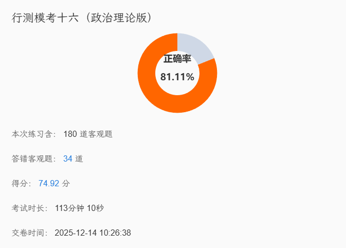

| 序号  | 部分       | 题数  | 答对题数 | 答错题数 | 未做题数 | 正确率   |
| --- | -------- | --- | ---- | ---- | ---- | ----- |
| 1   | 知觉速度和准确性 | 60  | 60   | 0    | 0    | 100 % |
| 2   | 政治理论     | 15  | 6    | 9    | 0    | 40 %  |
| 3   | 常识判断     | 15  | 11   | 4    | 0    | 73 %  |
| 4   | 言语理解与表达  | 25  | 20   | 5    | 0    | 80 %  |
| 5   | 数量关系     | 10  | 4    | 6    | 0    | 40 %  |
| 6   | 判断推理     | 35  | 28   | 7    | 0    | 80 %  |
| 7   | 资料分析     | 20  | 17   | 3    | 0    | 85 %  |

### **政治理论**

以县城为重要载体的城镇化建设

我国成为全球第二大消费市场、第一贸易大国，利用外资和对外投资都稳居世界前列

### **言语复盘**

|     |      |                                 |
| --- | ---- | ------------------------------- |
| 39  | 自说自话 | 独自决定、不顾他人意见，自己说了算               |
|     |      |                                 |
| 40  | 巧令名目 | 通过虚构名义以达到不正当目的的行为，常用于批评违规收费等情况。 |

双主题侧重！

对策敏感性！

### **判断推理**

| 细目  | 28/35 |
| --- | ----- |
| 图推  | 8/10  |
| 定义  | 6/10  |
| 类比  | 5/5   |
| 推理  | 9/10  |

图推-曲线数！！（近期遗漏点）

曲线-曲直性、曲直交点、曲线数

企业&政府双重坑！！

|         |          |     |
| ------- | -------- | --- |
| 天地合而万物生 | 古代朴素唯物主义 |     |
| 沧海桑田    | 事物都在变化发展 |     |

### **数量关系**

117题型积累
