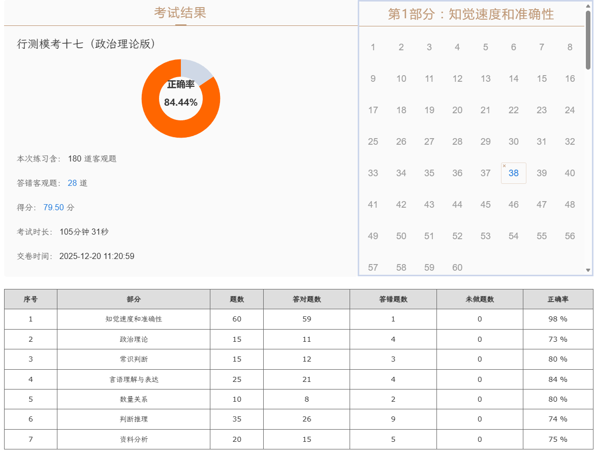

| 序号  | 部分       | 题数  | 答对题数 | 答错题数 | 未做题数 | 正确率  |
| --- | -------- | --- | ---- | ---- | ---- | ---- |
| 1   | 知觉速度和准确性 | 60  | 59   | 1    | 0    | 98 % |
| 2   | 政治理论     | 15  | 11   | 4    | 0    | 73 % |
| 3   | 常识判断     | 15  | 12   | 3    | 0    | 80 % |
| 4   | 言语理解与表达  | 25  | 21   | 4    | 0    | 84 % |
| 5   | 数量关系     | 10  | 8    | 2    | 0    | 80 % |
| 6   | 判断推理     | 35  | 26   | 9    | 0    | 74 % |
| 7   | 资料分析     | 20  | 15   | 5    | 0    | 75 % |

### **政治理论**

江苏——具有世界凝合力的双向开放枢纽

长期护理保险不属于养老保险范畴

培育银发经济经营主体，发挥国有企业引领示范作用

### **言语**

|     |      |                               |
| --- | ---- | ----------------------------- |
| 43  | 拍手称快 | 形容仇恨得到消除、正义得到伸张或者目的得到实现时的痛快心情 |
|     | 众口交谪 | 众人一起指责、批评。                    |
|     | 瞠目结舌 | 形容极端惊讶和窘迫                     |

萌生后接抽象事物

### **数量**

相遇问题，算两者总路程，奇数次相遇

### **判断**

图推质量一般

线应该是低频考点了

部分数特征——内外图形

刻意制造面小心

| 细目  | 26/35 |
| --- | ----- |
| 图推  | 6/10  |
| 定义  | 7/10  |
| 类比  | 3/5   |
| 推理  | 10/10 |

### **资料**

！！！错太多！

千分点！坑