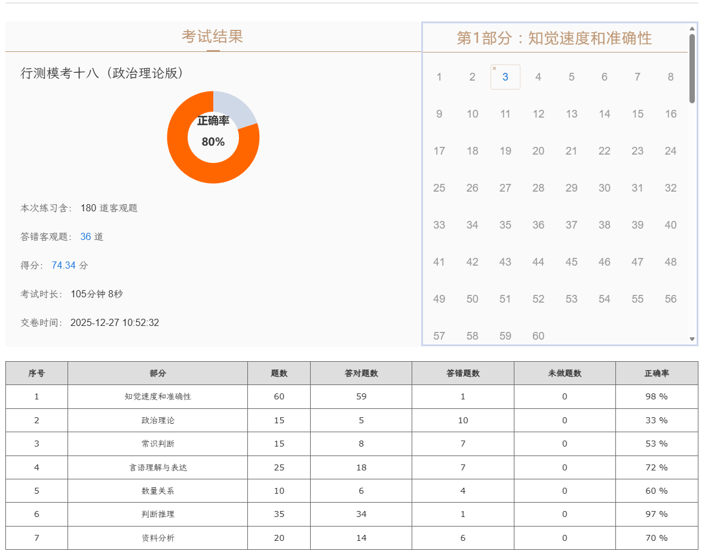

|序号|部分|题数|答对题数|答错题数|未做题数|正确率|
|---|---|---|---|---|---|---|
|1|知觉速度和准确性|60|59|1|0|98 %|
|2|政治理论|15|5|10|0|33 %|
|3|常识判断|15|8|7|0|53 %|
|4|言语理解与表达|25|18|7|0|72 %|
|5|数量关系|10|6|4|0|60 %|
|6|判断推理|35|34|1|0|97 %|
|7|资料分析|20|14|6|0|70 %|

::: warning 反思

资料基期坑！！

要快

:::

### **政治理论**

增强均衡性和普及性

社会保障体系是人民生活的安全网和社会运行的稳定器

分配制度是促进共同富裕的基础性制度

人民健康是民族昌盛和国家强盛的重要标志

### **常识判断**

人形机器人可以无缝使用人类所有基础设施和工具

企业要以货币刑事将劳动报酬支付给新就业形态劳动者本人，不得以实物及有价证券替代货币支付

### **言语**

形单影只单形容孤独没有伴侣

单枪匹马体现单独行动，没有别人帮助

条分缕析地分析 ×

### **判断**

图推——三角形可以藏起来

