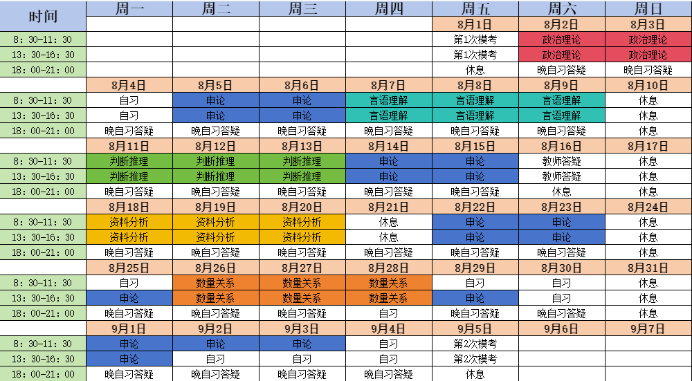
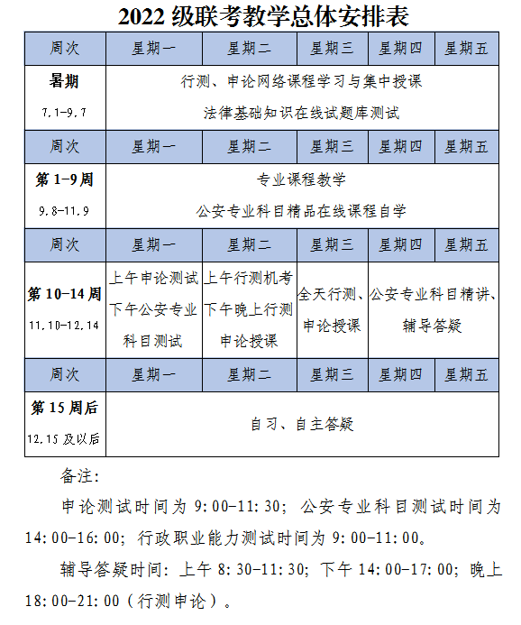

 

<RepoCard repo="youngking-gfy/Y0ungK1ngWorld" />

# 专题讲解

本专题主要整理和讲解公务员考试（公考）相关内容，涵盖以下三个方面：

1. [**公安专业知识**](/ncsec/avrj0bx2/)  
   包括公安基础理论、法律法规、公安业务流程、案例分析等内容，帮助考生系统掌握公安类岗位所需的专业知识。

2. [**申论**](/ncsec/jd9n86fk/)  
   介绍申论的基本题型、答题技巧、写作方法和高分范文，帮助考生提升申论写作能力和综合分析能力。

3. [**行测**](/ncsec/evqrjpxi/)  
   包括数量关系、判断推理、言语理解与表达、资料分析等模块，提供解题思路、常用方法和练习题，帮助考生全面提升行测成绩。

本专题内容将持续更新，欢迎关注与交流

# 模考成绩

### 8.1

| 序号         | 448   |
| ---------- | ----- |
| 省份         | 浙江    |
| 选报机构       | 中公    |
| 8.1 行测成绩   | 49.6  |
| 8.1 行测成绩排名 | 924   |
| 行测平均分      | 62.6  |
| 8.1 申论成绩   | 72    |
| 8.1 申论成绩排名 | 3     |
| 申论平均分      | 54.86 |
| 8.1 折合成绩   | 41.44 |
| 8.1 折合成绩排名 | 481   |
| 折合平均分      | 41.5  |

### 9.5

| 选报机构  | 中公    |
| ----- | ----- |
| 行测成绩  | 71.4  |
| 行测排名  | 209   |
| 申论成绩  | 58.5  |
| 申论排名  | 513   |
| 折合分数  | 46.11 |
| 折合分排名 | 289   |

### 9.21

| 生源地   | 浙江    |
| ----- | ----- |
| 选报机构  | 中公    |
| 行测成绩  | 70.9  |
| 行测排名  | 563   |
| 申论成绩  | 62    |
| 申论排名  | 255   |
| 折合分数  | 46.96 |
| 折合分排名 | 420   |

### 10.19

| 班级   | 中公9班 |
| ---- | ---- |
| 行测成绩 | 73   |
| 行测排名 | 156  |
| 申论总分 | 58   |
| 申论排名 | 516  |
| 折合分数 | 46.6 |
| 折合排名 | 280  |

### 11.1

| 班级   | 中公9班  |
| ---- | ----- |
| 行测成绩 | 77.4  |
| 行测排名 | 85    |
| 申论总分 | 53    |
| 申论排名 | 674   |
| 折合分数 | 46.86 |
| 折合排名 | 246   |

### 11.10

| 班级   | 中公9班  |
| ---- | ----- |
| 行测成绩 | 80.3  |
| 行测排名 | 32    |
| 申论总分 | 64    |
| 申论排名 | 24    |
| 公专成绩 | 58    |
| 公专排名 | 577   |
| 折合分数 | 68.72 |
| 折合排名 | 39    |

### 11.17

| 班级   | 中公9班  |
| ---- | ----- |
| 行测成绩 | 78.80 |
| 行测排名 | 164   |
| 申论总分 | 56.5  |
| 申论排名 | 521   |
| 公专成绩 | 73    |
| 公专排名 | 177   |
| 折合分数 | 70.37 |
| 折合排名 | 203   |

### 11.24

| 班级   | 中公9班  |
| ---- | ----- |
| 行测成绩 | 78.80 |
| 行测排名 | 148   |
| 申论总分 | 57.5  |
| 申论排名 | 525   |
| 公专成绩 | 62    |
| 公专排名 | 699   |
| 折合分数 | 67.37 |
| 折合排名 | 402   |

### 12.1

| 班级   | 中公9班  |
| ---- | ----- |
| 行测成绩 | 66.2  |
| 行测排名 | 351   |
| 申论总分 | 66    |
| 申论排名 | 187   |
| 公专成绩 | 59    |
| 公专排名 | 757   |
| 折合分数 | 63.98 |
| 折合排名 | 497   |

### 12.7

| 班级   | 中公9班  |
| ---- | ----- |
| 行测成绩 | 70.4  |
| 行测排名 | 367   |
| 申论总分 | 61    |
| 申论排名 | 202   |
| 公专成绩 | 65    |
| 公专排名 | 440   |
| 折合分数 | 65.96 |
| 折合排名 | 246   |

### 模考成绩对比

| 模考日期       |  8.1  | 9.14  | 9.21  | 10.19 | 11.1  | 11.2  | 11.17 | 11.24 | 12.1  | 12.7  |
| ---------- | :---: | :---: | :---: | :---: | :---: | :---: | :---: | :---: | :---: | :---: |
| 选报机构       |  中公   |  中公   |  中公   |  中公   |  中公   |  中公   |  中公   |  中公   |  中公   |  中公   |
| 行测成绩       | 49.6  | 71.4  | 70.9  |  73   | 77.4  | 80.3  | 78.80 | 78.80 | 66.2  | 70.4  |
| 行测成绩排名     |  924  |  209  |  563  |  156  |  85   |  32   |  164  |  148  |  351  |  367  |
| 行测平均分      | 62.6  |   -   |   -   |  63   |   -   |   -   |   -   |   -   |   -   |   -   |
| 申论成绩       |  72   | 58.5  |  62   |  58   |  53   |  64   | 56.5  | 57.5  |  66   |  61   |
| 申论成绩排名     |   3   |  513  |  255  |  516  |  674  |  24   |  521  |  525  |  187  |  202  |
| 申论平均分      | 54.86 |   -   |   -   | 54.5  |   -   |   -   |   -   |   -   |   -   |   -   |
| 公专成绩       |   -   |   -   |   -   |   -   |   -   |  58   |  73   |  62   |  59   |  65   |
| 公专成绩排名     |   -   |   -   |   -   |   -   |   -   |  577  |  177  |  699  |  757  |  440  |
| 8.1 折合成绩   | 41.44 | 46.11 | 46.96 | 46.6  | 46.86 | 68.72 | 70.37 | 67.37 | 63.98 | 65.96 |
| 8.1 折合成绩排名 |  481  |  289  |  420  |  280  |  246  |  39   |  203  |  402  |  497  |  246  |
| 折合平均分      | 41.5  |   -   |   -   | 46.6  |   -   |   -   |   -   |   -   |   -   |   -   |

# 集训时间表

### **计划**

