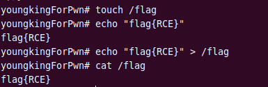
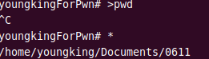
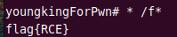

> 大道至简
### 限制字符RCE

这个考点呼应了一个很核心的论点——“Linux下万物皆文件”

我们需要自行建立命令来

通过`>`来创建文件

我们来自行创建命令，然后用`*`引用文件，就可以用一个字符代替一个命令，可以极大缩短

这里有一个前提，就是一定是一个空的命令执行的文件夹，防止其他文件的干扰，所以一般这种题目会建立随机文件夹目录

### 实操

先在根目录创建flag文件




建立随机文件夹


尝试一个`pwd`命令



测试成功

接下来实现一个5字符实现RCE

清空命令


创建`cat`命令
之后`* /f*`



``` bash
* /f*
```

上面`*`代表`cat`
`/f*`代表根目录下flag文件

